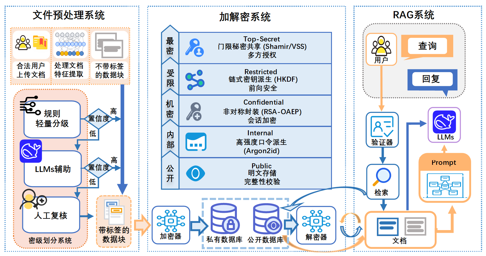

<div align="center">
  
  
  
  <p style="font-size: 24px; font-weight: bold;">御典：可证明安全的检索增强生成系统</p>

  [简体中文](README.md) | [English](README_EN.md)

  [](https://arxiv.org/abs/2508.01084)
  
  
</div>

<div align="center">
  
</div>

---

**御典** 是一个实现了**权限控制**与**分级加密**的检索增强生成（RAG）系统，旨在解决企业级 RAG 应用中的数据安全与隐私保护问题。

通过引入严格的**访问控制层**和**分级加密**机制，御典 确保只有具备相应权限的用户才能检索和访问特定的知识库内容，防止敏感信息在 RAG 检索过程中泄露。

### 核心特性

*   **🛡️ 分级权限控制**: 实现了基于等级的用户与文档访问控制，确保信息流向的安全性。
*   **🔒 分级加密**: 对不同敏感级别的文档采用分级加密存储与索引，保障数据静态与传输安全。
*   **🧠 高效 RAG 引擎**: 基于 **LlamaIndex** 和 **ChromaDB** 构建，支持高性能的向量检索与大模型生成。
*   **🖥️ 全栈架构**:
    *   **前端**: Next.js 构建的现代化交互界面。
    *   **后端**: Spring Boot 提供稳健的业务逻辑与鉴权服务。
    *   **RAG 服务**: Python (FastAPI) 提供核心的 AI 检索能力。
*   **📦 容器化部署**: 提供完整的 Docker Compose 支持，一键启动所有服务（MinIO, MySQL, ChromaDB, Web App）。


### 快速开始

#### 前置要求

*   [Docker](https://www.docker.com/) & [Docker Compose](https://docs.docker.com/compose/)
*   OpenAI API Key (或兼容的 LLM 服务)

#### 安装步骤

1.  **克隆仓库**

    ```bash
    git clone https://github.com/Dwinovo/SafRAG
    cd SafRAG
    ```

2.  **配置环境变量**

    复制示例配置文件并填入你的配置（特别是 `OPENAI_API_KEY`）：

    ```bash
    cp .env.example .env
    # 编辑 .env 文件，填入你的 API Key 和其他配置
    ```

3.  **启动服务**

    使用 Docker Compose 一键启动所有服务：

    ```bash
    docker-compose up -d
    ```

4.  **访问应用**

    *   **Web 前端**: [http://localhost:3000](http://localhost:3000)
    *   **MinIO 控制台**: [http://localhost:9001](http://localhost:9001) (默认账号密码见 `.env`)

### 系统架构

*   **Client**: Next.js (Port 3000) - 用户界面，负责文档上传、聊天交互与管理。
*   **Server**: Spring Boot (Port 8080) - 核心业务系统，管理用户权限、知识库元数据与安全策略。
*   **RAG Engine**: Python/FastAPI (Port 8000) - 负责文档切片、向量嵌入（Embedding）与检索生成。
*   **Infrastructure**:
    *   **MySQL**: 存储业务数据（用户、权限、元数据）。
    *   **MinIO**: 对象存储，用于存放原始文档。
    *   **ChromaDB**: 向量数据库，存储 Embedding 索引。

---

### License

[MIT](LICENSE) © 2025 SafRAG Contributors

### 引用

本项目基于以下论文的核心思想：

```bibtex
@article{zhou2025provably,
  title={Provably secure retrieval-augmented generation},
  author={Zhou, Pengcheng and Feng, Yinglun and Yang, Zhongliang},
  journal={arXiv preprint arXiv:2508.01084},
  year={2025}
}
```